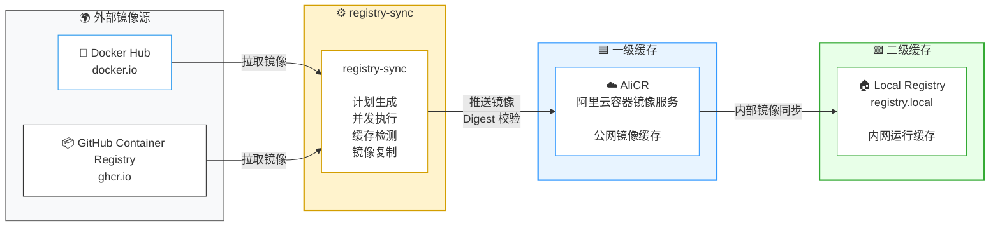

[](https://github.com/yangtudou/docker-compose/actions/workflows/registry-sync.yml)

# 记录 docker 玩法

> [!TIP]
> 镜像通过 github action 同步到阿里云私有仓库

<!-- IMAGES_TABLE_START -->

<!-- IMAGES_TABLE_END -->

## 一把梭

### 创建网络

```
docker network create homelab-net
```



